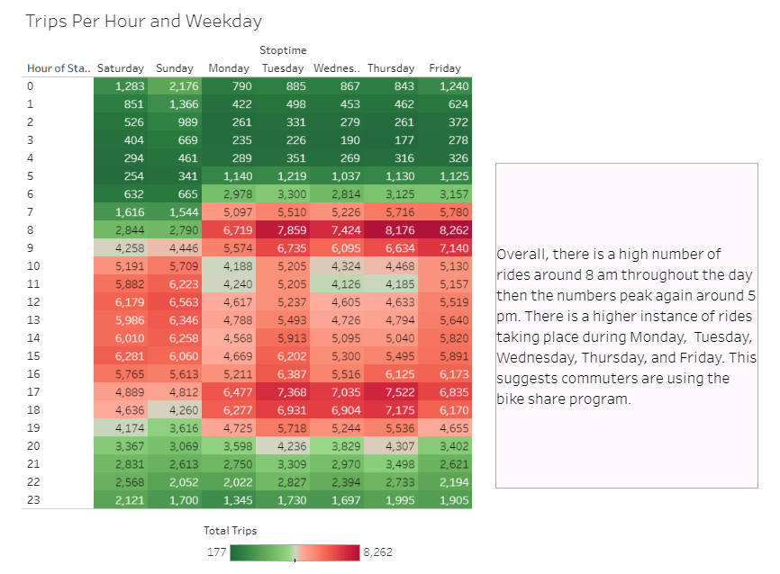

# Citi Bike Analysis

## Objective 
I was assigned the task of consolidating data extracted from the [Citi Bike Trip History Logs](https://citibikenyc.com/system-data) in New York City to identify any unforeseen patterns or occurrences. To accomplish this, I employed Jupyter Notebook and the Pandas library to clean the Citi Bike data collected in December 2019.

My final Story with my visualizations can be found on [Tableau](https://public.tableau.com/app/profile/theresa.bravo/viz/CitiBikeChallenge_16989430405190/Story1?publish=yes). 

## Considerations
* What demographics do the riders belong to?
* Are there more riders during certain days of the week?
* Where do riders usually start there trips? Where do they end these trips?

## Data Cleaning

I imported Citi Bike data from December 2019 into Jupyter Notebook and used the Pandas library. 

Then I updated the gender column to replace 1 as "Male", 2 as "Female", and 3 as "Unspecified". When creating the visuals, I filtered out "Unspecified". 

Finally, I calculated the "Age" column by subtracting 2019 from the "birth year" column. 

## Analysis

1. I found that there are higher numbers of Subscribers for both men and women. There are less casual Customers for both men and women. This suggests that it is more advantageous to be a Subscriber, possibly due to cost.
    * There is a higher number of male users than female users. Both men and women around the age of 30 account for the majority of trips. Additionally, men around the age of 50 also contribute significantly to the number of trips.  This information provides valuable insights into ridership accessability.

2. There is a high number of rides around 8 am throughout the day then the numbers peak again around 5 pm. There is a higher instance of rides taking place during Monday,  Tuesday, Wednesday, Thursday, and Friday. This suggests commuters are using the bike share program. 

3. The significant cluster of starting and ending trips in Lower Manhattan indicating a bustling transportation hub.

* Pershing Square North has the most starting trips which suggest that its central location makes it easily accessible for riders.
    * The recurrence of several end station names in the "Top 10 Start Station Names" slide further strengthens the notion of these locations serving as key transportation hubs.

## Conclusions

* Predominantly, the riders were males aged around 30, with the majority being Subscribers, indicating cost-efficiency for frequent riders.

* Weekdays between 8 am and 5 pm saw higher rental activity, making commuters an attractive target demographic.

* The primary usage hubs were located in Lower Manhattan, signifying its importance as a transportation center, facilitating Citi Bike accessibility.

* Notably, Pershing Square North recorded the highest start and end trip counts, suggesting that expanding Citi Bike stations in this vicinity could drive profits even higher due to its popularity and accessibility.

My final Story with my visualizations can be found on [Tableau](https://public.tableau.com/app/profile/theresa.bravo/viz/CitiBikeChallenge_16989430405190/Story1?publish=yes). 
